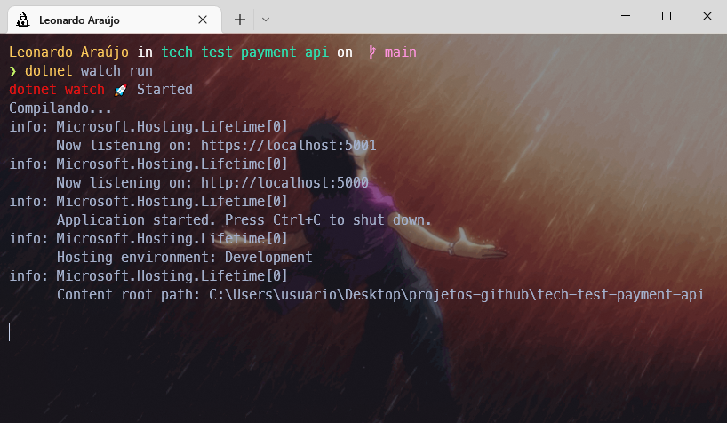

## Resolução do desafio de teste técnico Pottencial Tech-Test-Payment-API

<a href="#teste">Teste</a>&nbsp;&nbsp;&nbsp;
<a href="#projeto">O projeto</a>&nbsp;&nbsp;&nbsp;
<a href="#instrucoes">Instalação & Instruções</a>&nbsp;&nbsp;&nbsp;
<a href="#regra-negocio">Regras de negócios</a>&nbsp;&nbsp;&nbsp;
<a href="#referencias">Referências</a>&nbsp;&nbsp;&nbsp;

## O TESTE

- Construir uma API REST utilizando .Net Core, Java ou NodeJs (com Typescript);
- A API deve expor uma rota com documentação swagger (http://.../api-docs).
- A API deve possuir 3 operações:
  1. Registrar venda: Recebe os dados do vendedor + itens vendidos. Registra venda com status "Aguardando pagamento";
  2. Buscar venda: Busca pelo Id da venda;
  3. Atualizar venda: Permite que seja atualizado o status da venda.
     - OBS.: Possíveis status: `Pagamento aprovado` | `Enviado para transportadora` | `Entregue` | `Cancelada`.
- Uma venda contém informação sobre o vendedor que a efetivou, data, identificador do pedido e os itens que foram vendidos;
- O vendedor deve possuir id, cpf, nome, e-mail e telefone;
- A inclusão de uma venda deve possuir pelo menos 1 item;
- A atualização de status deve permitir somente as seguintes transições:
  - De: `Aguardando pagamento` Para: `Pagamento Aprovado`
  - De: `Aguardando pagamento` Para: `Cancelada`
  - De: `Pagamento Aprovado` Para: `Enviado para Transportadora`
  - De: `Pagamento Aprovado` Para: `Cancelada`
  - De: `Enviado para Transportador`. Para: `Entregue`
- A API não precisa ter mecanismos de autenticação/autorização;
- A aplicação não precisa implementar os mecanismos de persistência em um banco de dados, eles podem ser persistidos "em memória".

## O projeto

### API Swagger

### Visualização em JSON

## Instruções para instalar e rodar o projeto

#### Dependências & Libs Necessárias

- . Donet 5

- .NET SDKs 5.0.408

#### Como rodar a API

- Faça clone

- Em seu terminal abra na pasta raiz do projeto
  (tech-test-payment-api)

- Digite o command para copilar e API abrir em seu navegador:

      dotnet watch run

  Exemplo:

  

> Caso seu navegador não abra a API, você pode digitar a URL

      https://localhost:5001/swagger/index.html

## Regras de negócio implementadas ao desafio

### Classes desenvolvidas

### Endpoints desenvolvidos

#### Buscar vendas

#### Buscar venda por IdVenda

- Se for número inteiro

#### Buscar vendas por Status

- Venda:
  - Se status for válido (não nulo, vazio, espaço)

#### Adicionar nova venda

- Vendedor:
- Se nome for válido (não nulo, vazio, espaço)
- Se o CPF for válido
- Se e-mail for válido
- Se telefone for válido (criar lógica)

- Produtos:
- Se quantidade de produtos for 1 ou menor igual a 100
- Se descrição for válida (não nulo, vazio, espaço)
- Se preço for R$0.50 ou menor igual a R$5000.00

#### Atualizar status de uma venda

- Venda:

  - Se status for válido

  - Se atender regras para mudança do status:

  1. De: `Aguardando pagamento` Para: `Pagamento Aprovado`

  2. De: `Aguardando pagamento` Para: `Cancelada`

  3. De: `Pagamento Aprovado` Para: `Enviado para Transportadora`

  4. De: `Pagamento Aprovado` Para: `Cancelada`

  5. De: `Enviado para Transportador`. Para: `Entregue`

  6. Status: `Cancelada` não permite sua alteração

#### Atualizar produtos de uma venda

- Venda:

  - Se Status atual for **"Aguardando Pagamento"**

- Produtos:
  - Se descrição for válida (não nulo, vazio, espaço)
  - Se quantidade de produtos for 1 ou menor ou igual a 100
  - Se preço for R$0.50 ou menor igual a R$50000.00

#### Atualizar vendedor de uma venda

- Venda:

  - Se Status atual for **"Aguardando Pagamento"**

- Vendedor:
  - Se nome for válido (não nulo, vazio, espaço)
  - Se o CPF for válido
  - Se e-mail for válido
  - Se telefone for válido (não nulo, vazio, espaço)

#### Deletar uma venda

- Regras para remoção:

  - Se Status for **Aguardando pagamento** ou **"Cancelada”**

## Referências

- [.NET 5 REST API Tutorial - Build From Scratch With C#](https://youtu.be/ZXdFisA_hOY)

- [A importância e o uso do Data Annotation](https://imasters.com.br/dotnet/importancia-e-o-uso-data-annotation)

- [Regex em C#: como utilizar expressões regulares](https://www.alura.com.br/artigos/regex-c-sharp-utilizar-expressoes-regulares?gclid=CjwKCAjwkaSaBhA4EiwALBgQaBmyi6EbjSnPaSVUa0BewlrjU5WPHkviv_VOC-zcTPPWD5w9xnD-PRoCe9gQAvD_BwE)

- [Expressão regular para validar um campo que aceita CPF ou CNPJ](https://pt.stackoverflow.com/questions/11045/express%C3%A3o-regular-para-validar-um-campo-que-aceita-cpf-ou-cnpj)
